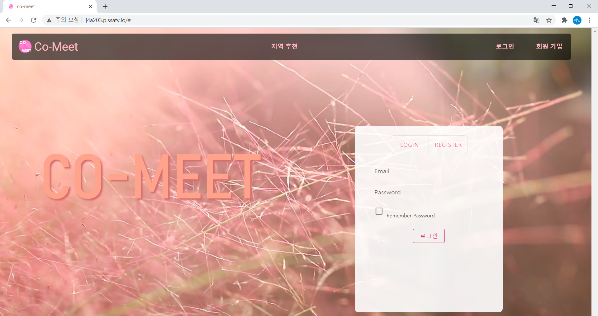
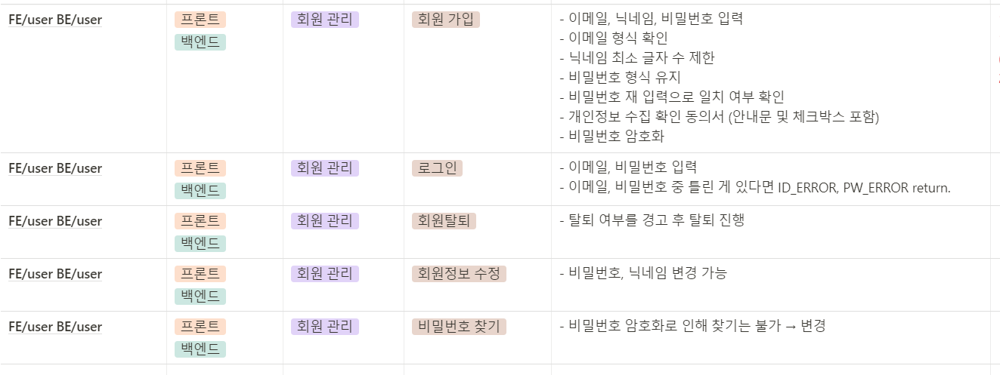
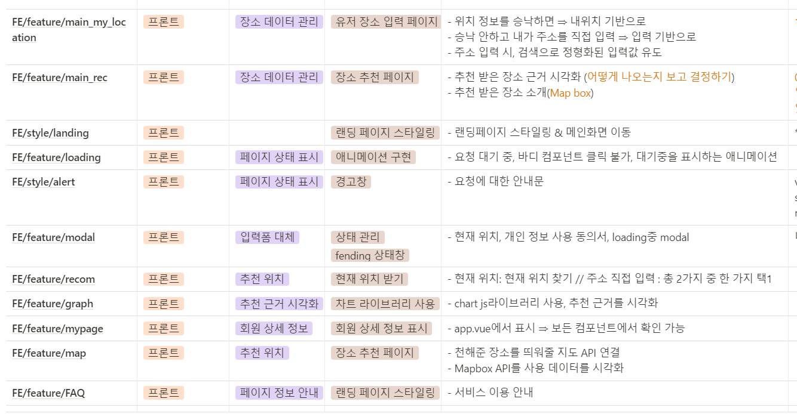
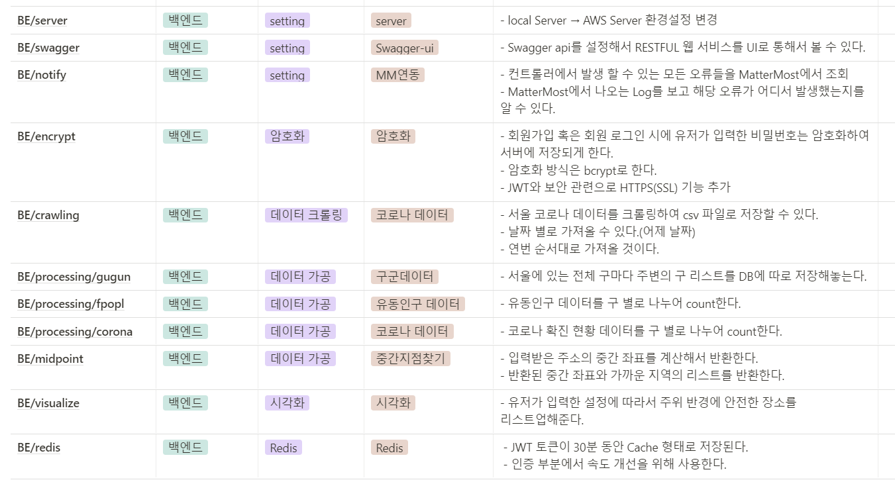
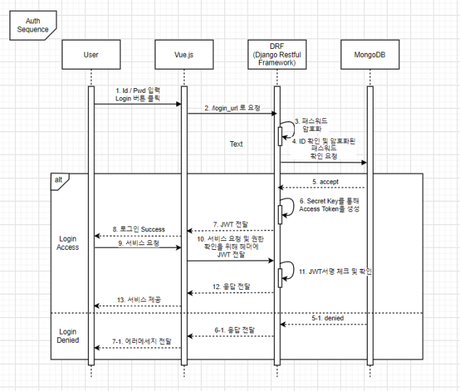
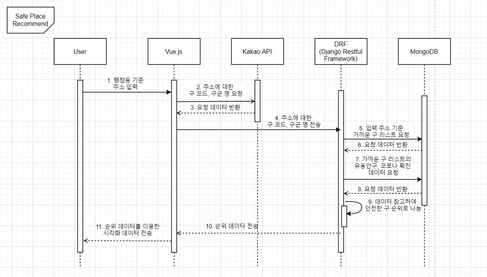
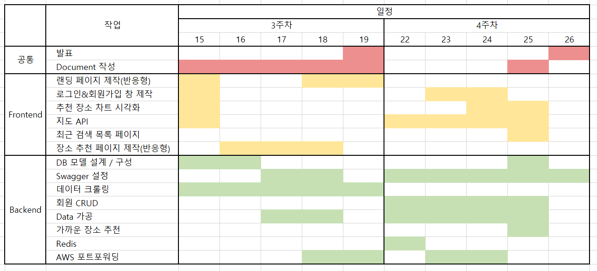

##  CO-MEET


> **Co-** (함께) + **Meet** (약속) = **CO-MEET**


## SWAGGER-UI

[SWAGGER](https://j4a203.p.ssafy.io/swagger/)

## 프로젝트 개요

- **진행기간** : 2021.03.02 ~ (ing)
- **만든이** : 강세준, 김영록, 장덕인, 최낙훈, 한승엽
- **기획 배경**
   - **위드 코로나 시대**에 더 이상 집콕만 할 수 없는 우리들
   - 어떻게 하면 사람이 **밀집된** 지역이나 **위험 지역**을 피해서 친구들을 만날 수 있을까?
   - **유동인구, 카드 사용량**을 바탕으로 비교적 사람이 적은 장소를 물색한다.
   - 지역별(동기준) 코로나 **상승률을 분석**하여 **현재 위치를 기반**으로 가장 안전한 장소를 찾아보자 !
   - **코로나 시대에 안전하게 만날 수 있는 약속 장소 추천 서비스!**
- **목표**
   - 코로나 확진자 발병 지역과 지역 별 확진자 변화 분석
   - 코로나 확진자 발병 지역을 참고하여 비교적 안전한 약속 장소를 추천
   - 현재 위치 정보 기준으로 일정 km 이내의 안전한 약속 장소를 찾아 추천.
   - 여러 명의 위치 기준으로 중간 지점을 추천하는 기능 추가 도입

## Project setup
```
yarn install
```

### Compiles and hot-reloads for development
```
yarn serve
```

### Compiles and minifies for production
```
yarn build
```

### Lints and fixes files
```
yarn lint
```

```bash
// installation

yarn global add @vue/cli
yarn global upgrade --latest @vue/cli
vue create co-meet
vue add router
yarn add vuex
yarn add vuetify
```


## 📄 **활용 데이터 및 API**

> 유동 인구 데이터
   
[데이터 기본 설명](https://www.bigdatahub.co.kr/product/view.do?pid=1002348)
      
>  코로나 지역관리본부 크롤링
   
[코로나 실시간 서울시 구별 확진자 동향 데이터](https://www.seoul.go.kr/coronaV/coronaStatus.do)
      
> 카드 사용 데이터
   
[카드 사용 데이터](https://dacon.io/competitions/official/235618/data/)
      
> 현 사용자 위치 정보 (크롬 기반)
   
[Geolocation API](https://www.zerocho.com/category/HTML&DOM/post/59155228a22a5d001827ea5d)

   - 유동인구 & 카드 사용량 분석 ⇒ 사람 ⬇ 밀집도 ⬇
   
     지역별 코로나 상승률 분석 ⇒ 코로나 발생률 ⬇ 안정성 ⬆

     현재 위치 & 검색 위치 기반 ⇒ 편의성 ⬆


  

## Document
<details>
    <summary> Convention </summary>
    <ul>
        <a href="Document/Convention/Python_Convention.md"><li> Python_Convention</li></a>
    </ul>
</details>
<details>
    <summary> Commit Rule</summary>
    <ul>
        <a href="Document/Commit Rule/Git Commit Rule.md"><li> Git Commit Rule</li></a>
    </ul>
</details>
<details>
    <summary> Specification</summary>
    <ul>



    </ul>
</details>
<details>
    <summary> Data Modeling</summary>
    <ul>
        <a href="Document/Data Modeling/Data Modeling.md"><li> Data Modeling</li></a>
    </ul>
</details>
<details>
    <summary> Wireframe</summary>
    <ul>
        <a href="Document/Wireframe/Wireframe.md"><li> Wireframe</li></a>
    </ul>
</details>
<details>
    <summary> Implementation Part</summary>
    <ul>
        <a href="Document/Implementation part/Implmt.md"><li> Implementation Part</li></a>
    </ul>
</details>
<details>
<details>
    <summary> Architecture </summary>
    <ul>
        <a href="Document/Architecture/architecture.md"><li> Architecture</li></a>
    </ul>
</details>
<details>
    <summary> Sequence Diagram </summary>
    <ul>

        

    </ul>
</details>
<details>
    <summary> DB ERD </summary>
    <ul>
        <a href="Document/DB ERD/erd.md"><li> ERD </li></a>
    </ul>
</details>
<details>
    <summary> Milestone</summary>
    <ul>



    </ul>
</details>
<details>
    <summary> Page Screenshot</summary>
    <ul>
        <a href="Document/Page Screenshot/page.md"><li> Page Screenshot</li></a>
    </ul>
</details>